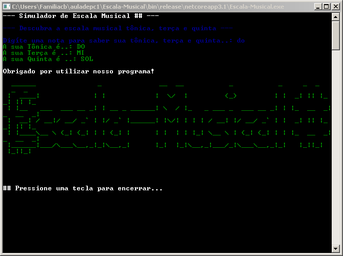

# Escala-Musical ##

Este Software descobre a escala musical, fazendo com que o usuário digite a nota musical, que no caso é tônica, terça e quinta.

## Exemplo

```
  ______               _              __  __           _           _     _  _     _  _   
 |  ____|             | |            |  \/  |         (_)         | |  _| || |_ _| || |_ 
 | |__   ___  ___ __ _| | __ _ ______| \  / |_   _ ___ _  ___ __ _| | |_  __  _|_  __  _|
 |  __| / __|/ __/ _` | |/ _` |______| |\/| | | | / __| |/ __/ _` | |  _| || |_ _| || |_ 
 | |____\__ \ (_| (_| | | (_| |      | |  | | |_| \__ \ | (_| (_| | | |_  __  _|_  __  _|
 |______|___/\___\__,_|_|\__,_|      |_|  |_|\__,_|___/_|\___\__,_|_|   |_||_|   |_||_|  
                                                                                         
                                                                                         

## Pressione uma tecla para encerrar...
```

## _Screenshoot_



## _Download_

Baixe o arquivo abaixo. Descompate na pasta desejada.

[📓 Download do arquivo .zip](Dist/Escala-Musical.zip.zip)

Execute utilizando o comando:

```
--- dotnet Escala-Musical.dll
```

Ou se estiver no Windows, de um duplo-click no programa ou clique com o botão direito do mouse, e depois clique em Executar como Administrador.

## _Complementos para instalação do Programa_

[🔲 Download do Winrar. .zip (3,09 MB)](winrar/winrar-5-91.exe)

## _Agradecimentos_

- [Figgle](https://github.com/drewnoakes/figgle)
- [Etec Adolpho Berezin](http://eteab.com.br/)
- [Felipe Barbosa](https://github.com/LipeClash)
- [Prof. Ermogenes Palacio](https://github.com/ermogenes/aulas-programacao-csharp)
- [Prof. Diego Neri](https://github.com/diegoneri)
- [Cifra Club](cifraclub.com.br)
- [Escala-Musical](https://github.com/LipeClash/Escala-Musical)

---

Todos os direitos reservados. SOFTWARE LIVRE, PIRATARIA É CRIME.
